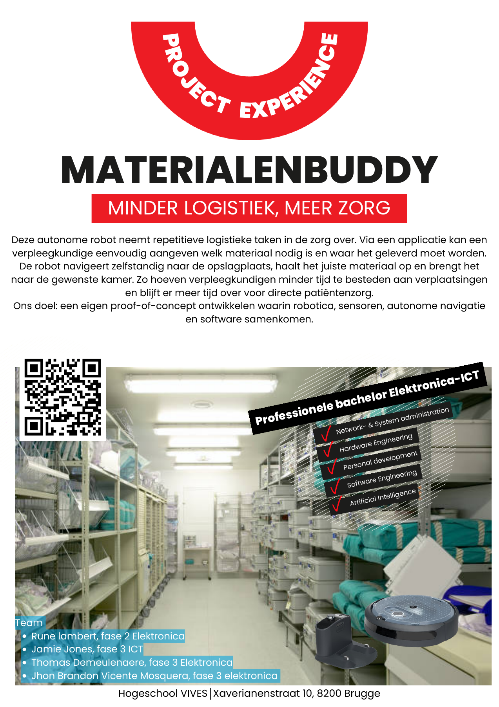

# MaterialenBuddy
## Team
- [ Rune Lambert, year 2](https://github.com/RuneLambert)
- [Thomas Demeulenaere, year 3](https://github.com/Thomas8650)
- [ Jamie Jones, year 3](https://github.com/JollyJones101)
- [Jhon Brandon Vicente Mosquera, Erasmus student](https://github.com/MarLon-MV)

## The assignment
The goal of this project is to develop an autonomous robot that can transport materials to designated locations in healthcare facilities. Through a web application, nursing staff can request the materials they need and specify a delivery location. By automating routine material transport tasks, the system allows nursing staff to spend more time on direct patient care.

## Posters

   
   

## Folder structure
- [research](./research/readme.md) : This contains all the ideas for this project.
- [media](./media/readme.md) : This contains everything from posters to Instagram posts.
